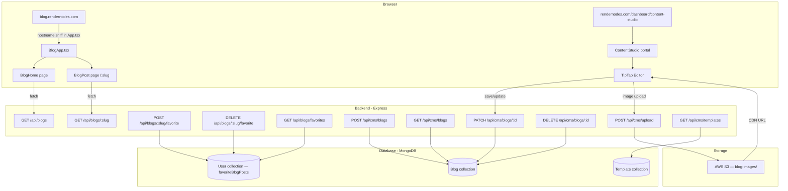

# Design Document — Blog CMS System

## Overview

The Blog CMS System adds two distinct surfaces to the RenderOnNodes platform:

1. **Public Blog** (`blog.rendernodes.com`) — a clean, reader-focused frontend served via hostname-sniffing in the existing Vite + React SPA. Visitors browse and read published posts; authenticated users can favorite posts.

2. **Content Studio** (`/dashboard/content-studio`) — a distraction-free writing portal for users with the `writer` or `admin` role. Built around a TipTap block editor with a Notion/Medium-style UX: full-screen layout, slash-command block insertion, floating formatting toolbar, and a collapsible metadata panel.

The backend extends the existing Express + MongoDB stack with a new `/api/cms/*` route group (authenticated, role-gated) and new public favorites endpoints on `/api/blogs/*`. The existing `Blog` Mongoose model, public blog routes, `authenticate`/`authorize` middleware, and `S3Service` are all reused directly.

---

## Architecture



### Key Architectural Decisions

- **Hostname sniffing** already exists in `App.tsx` (`window.location.hostname.startsWith('blog.')`). `BlogApp.tsx` is extended with the `/:slug` route — no new entry point needed.
- **CMS routes** live under `/api/cms/*` in a new `cms.routes.ts` file, mounted in `app.ts`. All routes require `authenticate` + `authorize('writer', 'admin')` at the router level.
- **Favorites** are added to the existing `blogs.ts` public route file to keep public blog concerns together.
- **Image uploads** use `multer` (memory storage) piped to the existing `S3Service.uploadBlogImage()` method (new method added to S3Service). The S3 key prefix is `blog-images/`.
- **Auto-save** is a 30-second `setInterval` in the editor component, calling `PATCH /api/cms/blogs/:id` only when the post has been saved at least once (has an `_id`).
- **Template seeding** runs at app startup via a `seedTemplates()` function called in `index.ts`.

---

## Components and Interfaces

### Public Blog Frontend

```
BlogApp (subdomain router)
├── BlogHome (existing — wired to real API)
│   ├── BlogCard (existing — add slug-based navigation)
│   └── FavoriteIndicator (small count/icon on card)
└── BlogPost (NEW — route /:slug)
    ├── BlockRenderer
    │   ├── HeadingBlock
    │   ├── ParagraphBlock
    │   ├── ImageBlock
    │   ├── CodeBlock
    │   ├── ListBlock (ordered / unordered)
    │   ├── TableBlock
    │   └── QuoteBlock
    ├── PostMeta (author, date, readTime, category)
    ├── FavoriteButton (dual-mode: localStorage / API)
    └── SEO (HelmetProvider title + meta)
```

**BlogApp.tsx** — extend routes:
```tsx
<Routes>
  <Route path="/" element={<BlogHome />} />
  <Route path="/:slug" element={<BlogPost />} />
  <Route path="*" element={<BlogHome />} />
</Routes>
```

**BlockRenderer** — maps `contentBlocks` JSON array to React elements:
```ts
interface ContentBlock {
  type: 'heading' | 'paragraph' | 'image' | 'codeBlock' |
        'orderedList' | 'bulletList' | 'table' | 'blockquote';
  attrs?: Record<string, any>;   // e.g. { level: 2 } for headings
  content?: ContentBlock[];       // nested inline content
  text?: string;
}
```

**FavoriteButton** — dual-mode component:
- Anonymous: reads/writes `localStorage.getItem('blogFavorites')` (JSON array of slugs)
- Authenticated (via `useAuthStore`): calls `POST /api/blogs/:slug/favorite` or `DELETE /api/blogs/:slug/favorite`

### Content Studio (CMS Portal)

```
ContentStudio (route /dashboard/content-studio/*)
├── PostListView (route: index)
│   ├── StatusFilterTabs (All / Draft / In Review / Published)
│   ├── SearchInput
│   ├── ViewToggle (table / card)
│   ├── PostTable / PostCardGrid
│   │   └── PostRow / PostCard
│   │       ├── StatusBadge
│   │       └── RowActions (Edit, Delete)
│   └── CreatePostButton → TemplateSelectModal
│       └── TemplateCard[]
└── PostEditorView (route: /new, /:id/edit)
    ├── EditorTopBar
    │   ├── BackArrow
    │   ├── TitleInput
    │   ├── StatusBadge
    │   └── ActionButtons (Save Draft / Submit for Review / Publish / Unpublish)
    ├── EditorSidebar (collapsible left)
    │   └── DocumentOutline (headings navigator)
    ├── TipTapEditor (center)
    │   ├── SlashCommandMenu
    │   ├── FloatingToolbar (Bold, Italic, Highlight, Link)
    │   └── ImageUploadBlock
    └── MetadataPanel (collapsible right)
        ├── CategorySelect
        ├── TagsInput
        ├── CoverImageUpload
        └── SEOPanel
            ├── SeoTitleInput (max 60, live char count)
            ├── SeoDescriptionTextarea (max 160, live char count)
            └── OgImageUpload
```

### TipTap Editor Extensions

| Extension | Purpose |
|---|---|
| `StarterKit` | Heading, Paragraph, Bold, Italic, BulletList, OrderedList, Blockquote, CodeBlock, HardBreak |
| `Highlight` | Text highlight |
| `Link` | Hyperlinks with `openOnClick: false` |
| `Table` + `TableRow` + `TableCell` + `TableHeader` | Table blocks |
| `Image` (custom) | Image blocks with upload progress state |
| `Placeholder` | "Type '/' for commands…" in empty blocks |
| `SlashCommand` (custom) | `/` trigger for block insertion menu |
| `DragHandle` (tiptap-extension-drag-handle) | Block drag-and-drop reordering |

### Backend Components

```
backend/main/src/
├── routes/api/
│   ├── blogs.ts          (existing — add favorites endpoints)
│   └── cms.routes.ts     (NEW)
├── controllers/
│   ├── cmsController.ts  (NEW — blog CRUD + image upload)
│   └── templateController.ts (NEW — template CRUD + seed)
├── models/
│   ├── Blog.ts           (existing — add favoritesCount field)
│   ├── Template.ts       (NEW)
│   └── User.ts           (existing — add favoriteBlogPosts field)
└── services/
    └── S3Service.ts      (existing — add uploadBlogImage method)
```

---

## Data Models

### BlogPost (extends existing `Blog.ts`)

```ts
interface IBlog extends Document {
  title: string;
  slug: string;                          // unique, URL-safe
  authorId: ObjectId;                    // ref: 'User'
  templateId?: string;                   // ref: 'Template' (optional)
  status: 'DRAFT' | 'IN_REVIEW' | 'PUBLISHED';
  category: string;
  tags: string[];                        // NEW
  contentBlocks: ContentBlock[];         // TipTap JSON (array of block nodes)
  seoMeta: {
    title: string;                       // max 60 chars
    description: string;                 // max 160 chars
    ogImage: string;                     // CDN URL
  };
  coverImage?: string;                   // CDN URL — NEW
  readTime: string;                      // e.g. "5 min read"
  favoritesCount: number;                // NEW — denormalized count
  pinned: boolean;
  publishedAt?: Date;
  createdAt: Date;
  updatedAt: Date;
}
```

New indexes to add:
```ts
blogSchema.index({ authorId: 1, updatedAt: -1 });  // CMS list queries
blogSchema.index({ status: 1, slug: 1 });           // public slug lookup
```

### Template (new `Template.ts`)

```ts
interface ITemplateSection {
  label: string;                         // e.g. "Introduction"
  allowedBlockTypes: ContentBlock['type'][];
  defaultBlocks: ContentBlock[];         // pre-populated TipTap nodes
}

interface ITemplate extends Document {
  name: string;                          // e.g. "Tutorial"
  description: string;                   // 1-line description
  category: string;                      // e.g. "Technical"
  icon: string;                          // emoji or icon name
  sections: ITemplateSection[];
  isBuiltIn: boolean;                    // true for the 5 seeded templates
  createdAt: Date;
  updatedAt: Date;
}
```

### User model update

Add to `IUser` interface and `userSchema`:
```ts
favoriteBlogPosts: ObjectId[];  // ref: 'Blog'
```

Schema field:
```ts
favoriteBlogPosts: [{
  type: Schema.Types.ObjectId,
  ref: 'Blog'
}]
```

---

## API Contract

### CMS Endpoints (all require `authenticate` + `authorize('writer', 'admin')`)

#### `POST /api/cms/blogs`
Create a new blog post.

Request body:
```json
{
  "title": "string",
  "slug": "string",
  "templateId": "string | undefined",
  "category": "string",
  "tags": ["string"],
  "contentBlocks": [],
  "seoMeta": { "title": "", "description": "", "ogImage": "" },
  "coverImage": "string | undefined"
}
```
Response `201`:
```json
{ "success": true, "blog": { ...IBlog } }
```
Response `409` (duplicate slug):
```json
{ "success": false, "error": "Slug already exists", "suggestedSlug": "my-post-2" }
```

#### `GET /api/cms/blogs`
List blog posts. Writers see only their own; admins see all.

Query params: `status`, `search`, `page`, `limit`

Response `200`:
```json
{ "success": true, "blogs": [...IBlog], "total": 42, "page": 1 }
```

#### `GET /api/cms/blogs/:id`
Fetch single post by MongoDB `_id`.

Response `200`: `{ "success": true, "blog": { ...IBlog } }`
Response `404`: `{ "success": false, "error": "Blog post not found" }`

#### `PATCH /api/cms/blogs/:id`
Update post fields. Author or admin only.

Request body: partial `IBlog` fields.

Status transition rules enforced server-side:
- `writer` role: may set `DRAFT` or `IN_REVIEW` only
- `admin` role: may set any status; setting `PUBLISHED` sets `publishedAt`; setting `DRAFT` from `PUBLISHED` clears `publishedAt`

Response `200`: `{ "success": true, "blog": { ...IBlog } }`
Response `403`: `{ "success": false, "error": "Insufficient permissions" }`

#### `DELETE /api/cms/blogs/:id`
Delete post. Author or admin only.

Response `200`: `{ "success": true, "message": "Blog post deleted" }`
Response `403`: `{ "success": false, "error": "Insufficient permissions" }`

#### `POST /api/cms/upload`
Upload image to S3.

Request: `multipart/form-data`, field `image`, max 10 MB, MIME: `image/jpeg`, `image/png`, `image/gif`, `image/webp`.

Response `200`:
```json
{ "success": true, "url": "https://cdn.rendernodes.com/blog-images/..." }
```
Response `400`: `{ "success": false, "error": "File too large" | "Invalid file type" }`

#### `GET /api/cms/templates`
List all templates.

Response `200`: `{ "success": true, "templates": [...ITemplate] }`

#### `POST /api/cms/templates` (admin only)
Create template.

#### `PATCH /api/cms/templates/:id` (admin only)
Update template.

#### `DELETE /api/cms/templates/:id` (admin only)
Delete template.

---

### Public Blog Endpoints (existing + new)

#### `GET /api/blogs` (existing — locked contract)
Returns published posts. Query: `category`, `limit`, `pinned`.

#### `GET /api/blogs/favorites` (NEW — must be registered BEFORE `/:slug`)
Requires `authenticate`.

Response `200`:
```json
{ "success": true, "blogs": [...IBlog] }
```

#### `GET /api/blogs/:slug` (existing — locked contract)
Returns single published post. `404` if not found.

#### `POST /api/blogs/:slug/favorite` (NEW)
Requires `authenticate`. Adds post `_id` to `user.favoriteBlogPosts` if not already present. Increments `blog.favoritesCount`.

Response `200`: `{ "success": true, "favorited": true }`

#### `DELETE /api/blogs/:slug/favorite` (NEW)
Requires `authenticate`. Removes post `_id` from `user.favoriteBlogPosts`. Decrements `blog.favoritesCount` (floor 0).

Response `200`: `{ "success": true, "favorited": false }`

---

## Correctness Properties

*A property is a characteristic or behavior that should hold true across all valid executions of a system — essentially, a formal statement about what the system should do. Properties serve as the bridge between human-readable specifications and machine-verifiable correctness guarantees.*

Property-based testing is applicable here because the system contains pure transformation functions (slug generation, block serialization, role authorization logic, favorites deduplication) where input variation meaningfully reveals edge cases and 100+ iterations provide substantially more coverage than a handful of examples.

**PBT library**: [`fast-check`](https://github.com/dubzzz/fast-check) for TypeScript (both frontend and backend).

---

### Property 1: Content Block Round-Trip

*For any* valid array of `ContentBlock` objects, serializing the array to JSON and then deserializing it back should produce a value that is deeply equal to the original array.

**Validates: Requirements 6.7, 6.8, 6.9**

---

### Property 2: Block Renderer Type Mapping

*For any* `ContentBlock` with a valid `type` field, the `BlockRenderer` component should render an HTML element that corresponds to the correct semantic element for that block type (e.g., `heading` → `<h1>`–`<h6>`, `paragraph` → `<p>`, `blockquote` → `<blockquote>`, `codeBlock` → `<pre><code>`, `image` → ``).

**Validates: Requirements 1.1, 1.3**

---

### Property 3: Slug Generation Invariant

*For any* non-empty title string, `generateSlug(title)` should produce a string that: (a) is entirely lowercase, (b) contains only alphanumeric characters and hyphens, (c) does not start or end with a hyphen, and (d) has no consecutive hyphens.

**Validates: Requirements 9.1**

---

### Property 4: Slug Uniqueness Invariant

*For any* two blog posts with different MongoDB `_id` values that exist in the database, their `slug` fields should never be equal. Attempting to save a blog post with a slug that already belongs to a different post should return a `409` response.

**Validates: Requirements 9.3, 9.4**

---

### Property 5: Writer Role Cannot Publish

*For any* authenticated user whose `roles` array contains `'writer'` but not `'admin'`, a `PATCH /api/cms/blogs/:id` request with `{ status: 'PUBLISHED' }` should always return a `403` response, regardless of the post's current status or content.

**Validates: Requirements 8.4**

---

### Property 6: Favorites Idempotency

*For any* authenticated user and any published blog post, calling `POST /api/blogs/:slug/favorite` one or more times should result in exactly one occurrence of that post's `_id` in the user's `favoriteBlogPosts` array — never duplicates.

**Validates: Requirements 16.8**

---

### Property 7: Favorites Filter — Only Published Posts Returned

*For any* user whose `favoriteBlogPosts` array contains a mix of `PUBLISHED` and non-`PUBLISHED` blog post IDs, `GET /api/blogs/favorites` should return only the posts with `status: 'PUBLISHED'`.

**Validates: Requirements 16.10**

---

### Property 8: CMS List Scoping Invariant

*For any* authenticated user with only the `writer` role, `GET /api/cms/blogs` should return only blog posts where `authorId` equals that user's `_id` — never posts authored by other users.

**Validates: Requirements 4.1, 10.2**

---

### Property 9: Author Ownership Invariant

*For any* blog post created via `POST /api/cms/blogs`, the `authorId` field in the stored document should equal the `userId` of the authenticated user who made the request, regardless of any `authorId` value supplied in the request body.

**Validates: Requirements 10.6**

---

### Property 10: SEO Meta Persistence Round-Trip

*For any* valid `seoMeta` object (with title ≤ 60 chars, description ≤ 160 chars, and a URL string for ogImage), saving a blog post with that `seoMeta` and then fetching it by ID should return a `seoMeta` object deeply equal to the one that was saved.

**Validates: Requirements 7.4**

---

## Error Handling

### Frontend

| Scenario | Handling |
|---|---|
| Blog post not found (404) | `BlogPost` page renders a "Post not found" state with a link back to `/` |
| API fetch failure on public blog | Show a generic error message; do not crash the page |
| Image upload failure in editor | Inline error below the image block; placeholder removed; toast notification |
| Auto-save failure | Silent retry once; if second attempt fails, show a non-blocking warning banner in the editor top bar |
| Slug conflict (409 on save) | Show inline error on the slug field with the suggested alternative slug |
| Unauthorized access to CMS | `ProtectedRoute` redirects to `/login` (unauthenticated) or `/dashboard` (wrong role) |

### Backend

| Scenario | HTTP Status | Response Shape |
|---|---|---|
| Blog post not found | `404` | `{ success: false, error: "Blog post not found" }` |
| Duplicate slug | `409` | `{ success: false, error: "Slug already exists", suggestedSlug: "..." }` |
| Writer attempts to publish | `403` | `{ success: false, error: "Insufficient permissions" }` |
| Non-author attempts edit/delete | `403` | `{ success: false, error: "Insufficient permissions" }` |
| File too large / wrong MIME | `400` | `{ success: false, error: "File too large" \| "Invalid file type" }` |
| S3 upload failure | `500` | `{ success: false, error: "Image upload failed" }` |
| Unauthenticated request to CMS | `401` | `{ success: false, error: "Authentication token required" }` |

Slug suggestion algorithm: append `-2`, `-3`, etc. until a unique slug is found (max 10 attempts, then append a short UUID suffix).

---

## Testing Strategy

### Unit Tests (example-based)

- `generateSlug()` pure function: specific title inputs → expected slug outputs
- `BlockRenderer`: render each block type with known data, snapshot the output
- `FavoriteButton`: anonymous mode reads/writes localStorage correctly
- `StatusBadge`: renders correct color and label for each status value
- `SEOPanel`: character counter displays correct count for known inputs
- `cmsController.createBlog`: sets `authorId` from `req.user.userId`, not request body
- `cmsController.updateBlog`: writer cannot set status to `PUBLISHED`
- `templateController.seed`: idempotent — running twice does not create duplicates

### Property-Based Tests (fast-check, minimum 100 iterations each)

Each test is tagged with the format: `Feature: blog-cms-system, Property N: <property_text>`

| Property | Test Description |
|---|---|
| P1: Content Block Round-Trip | Generate random `ContentBlock[]` arrays; serialize → deserialize → compare |
| P2: Block Renderer Type Mapping | Generate blocks of each type; verify rendered element type |
| P3: Slug Generation Invariant | Generate arbitrary title strings; verify slug output rules |
| P4: Slug Uniqueness Invariant | Generate pairs of posts; verify 409 on duplicate slug attempt |
| P5: Writer Role Cannot Publish | Generate writer users and posts; verify 403 on PUBLISHED PATCH |
| P6: Favorites Idempotency | Generate users and posts; call favorite N times; verify single entry |
| P7: Favorites Filter | Generate mixed-status favorites; verify only PUBLISHED returned |
| P8: CMS List Scoping | Generate multi-author post sets; verify writer sees only own posts |
| P9: Author Ownership | Generate users and create requests; verify authorId always matches |
| P10: SEO Meta Round-Trip | Generate valid seoMeta objects; save and fetch; verify deep equality |

### Integration Tests

- `GET /api/blogs` returns only `PUBLISHED` posts (1-2 examples)
- `GET /api/blogs/:slug` returns 404 for non-existent or non-published slug
- `POST /api/cms/upload` with valid image → S3 mock → CDN URL in response
- Template seed runs on startup and produces exactly 5 templates
- Favorites endpoints require authentication (401 without token)

### E2E / Manual Smoke Tests

- Full write flow: create post → select template → write content → upload image → submit for review → admin publishes → visible on public blog
- Slug conflict: create two posts with same title, verify second gets suggested slug
- Anonymous favorites: add/remove from localStorage, verify state persists on refresh
- Authenticated favorites: add favorite, log out, log in on different browser, verify favorite persists
