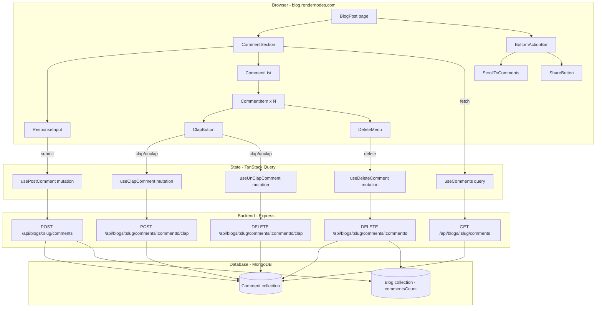

# Design Document — Blog Comments

## Overview

The Blog Comments feature adds a Medium-style responses section to each blog post page on `blog.rendernodes.com`. Authenticated users can post plain-text comments on published blog posts; all visitors can read them. Each comment supports a clap reaction (one per user), and comment authors (plus admins) can delete their own comments.

The feature also adds a `BottomActionBar` — a fixed bar at the bottom of the blog post viewport showing the total comment count (with a speech-bubble icon that scrolls to the comments section) and a share button.

The implementation extends the existing Express + MongoDB backend with new routes under `/api/blogs/:slug/comments`, a new `Comment` Mongoose model, and a small update to the `Blog` model. On the frontend, new React components are added to the existing `BlogPost` page on the blog subdomain.

---

## Architecture



### Key Architectural Decisions

- **New route file**: Comment endpoints live in a new `backend/main/src/routes/api/comments.ts` file, mounted in `app.ts` under both `/api/blogs` and `/blogs` prefixes (matching the existing pattern). This keeps the existing `blogs.ts` file clean.
- **Inline controller logic**: Given the small surface area (5 endpoints), controller logic is written directly in the route file rather than a separate controller, consistent with the existing `blogs.ts` pattern.
- **TanStack Query for state**: The frontend uses `@tanstack/react-query` (already in the project) for all comment data fetching and mutations. No new global store is needed — comment state is local to the `BlogPost` page via query keys scoped to the post slug.
- **Optimistic updates**: Comment count in the `BottomActionBar` and the "Responses (N)" heading are updated optimistically on submit/delete using TanStack Query's `onMutate` / `onError` rollback pattern.
- **`commentsCount` on Blog model**: A denormalized `commentsCount` field is added to the `Blog` model. It is incremented/decremented atomically using `$inc` in the same request that creates/deletes a comment. This avoids a separate count query on every page load.
- **`clappers` array as source of truth**: The `claps` integer is always kept equal to `clappers.length`. All clap/unclap operations use MongoDB `$addToSet`/`$pull` + `$inc` in a single atomic update.
- **Auth on blog subdomain**: The blog subdomain (`BlogApp`) does not have the `AuthInitializer` wrapper from the main app. The `BlogPost` page reads `useAuthStore` directly (the store is persisted to `localStorage` via Zustand persist), so the token is available without a separate auth flow.

---

## Components and Interfaces

### Frontend Component Tree

```
BlogPost (existing — extended)
├── ... (existing content, author card, tags)
├── CommentSection          NEW — ref={commentSectionRef}
│   ├── ResponseInput       NEW — shown only when authenticated
│   │   └── (sign-in prompt when unauthenticated)
│   └── CommentList         NEW
│       └── CommentItem[]   NEW
│           ├── AuthorAvatar
│           ├── ClapButton  NEW — interactive when authenticated
│           └── DeleteMenu  NEW — shown only to comment author / admin
└── BottomActionBar         NEW — fixed to viewport bottom
    ├── CommentCountButton  (scrolls to CommentSection)
    └── ShareButton
```

### Component Interfaces

```tsx
// CommentSection.tsx
interface CommentSectionProps {
  slug: string;
  initialCount: number;  // from blog.commentsCount — used for optimistic heading
}

// CommentList.tsx
interface CommentListProps {
  comments: IComment[];
  isLoading: boolean;
  isError: boolean;
  onRetry: () => void;
  currentUserId?: string;  // undefined when unauthenticated
  currentUserRoles?: string[];
  slug: string;
}

// CommentItem.tsx
interface CommentItemProps {
  comment: IComment;
  slug: string;
  currentUserId?: string;
  currentUserRoles?: string[];
  isAuthenticated: boolean;
}

// ResponseInput.tsx
interface ResponseInputProps {
  slug: string;
  currentUser: { id: string; name: string } | null;
}

// ClapButton.tsx
interface ClapButtonProps {
  commentId: string;
  slug: string;
  claps: number;
  hasClapped: boolean;   // derived from clappers.includes(currentUserId)
  isAuthenticated: boolean;
}

// BottomActionBar.tsx
interface BottomActionBarProps {
  commentCount: number;
  postTitle: string;
  commentSectionRef: React.RefObject<HTMLElement>;
}

// DeleteMenu.tsx
interface DeleteMenuProps {
  commentId: string;
  slug: string;
}
```

### Frontend Data Types

```ts
// Matches the API response shape for a populated comment
interface IComment {
  _id: string;
  blogId: string;
  authorId: {
    _id: string;
    name: string;
    username: string;
  };
  text: string;
  claps: number;
  clappers: string[];   // array of userId strings
  createdAt: string;    // ISO date string
  updatedAt: string;
}
```

### BlogPost Page Integration

The existing `BlogPost` component is extended minimally:

1. A `commentSectionRef` (`useRef<HTMLDivElement>`) is added and attached to the `CommentSection` wrapper.
2. `<CommentSection slug={slug} initialCount={blog.commentsCount ?? 0} />` is inserted after the author card and before the "More Posts" section.
3. `<BottomActionBar commentCount={...} postTitle={blog.title} commentSectionRef={commentSectionRef} />` is rendered at the bottom of the page (outside the `<article>` tag, inside the page `<div>`).
4. The `BlogPostData` interface gains `commentsCount: number`.

---

## Data Models

### Comment (new `Comment.ts`)

```ts
import mongoose, { Schema, Document } from 'mongoose';

export interface IComment extends Document {
  blogId: mongoose.Types.ObjectId;      // ref: 'Blog', required
  authorId: mongoose.Types.ObjectId;    // ref: 'User', required
  text: string;                         // max 1000 chars, required
  claps: number;                        // default 0; always equals clappers.length
  clappers: mongoose.Types.ObjectId[];  // ref: 'User', default []
  createdAt: Date;
  updatedAt: Date;
}

const commentSchema = new Schema<IComment>({
  blogId:   { type: Schema.Types.ObjectId, ref: 'Blog', required: true },
  authorId: { type: Schema.Types.ObjectId, ref: 'User', required: true },
  text:     { type: String, required: true, maxlength: 1000, trim: true },
  claps:    { type: Number, default: 0, min: 0 },
  clappers: [{ type: Schema.Types.ObjectId, ref: 'User' }],
}, { timestamps: true });

// Efficient Comment_List queries (newest first per blog)
commentSchema.index({ blogId: 1, createdAt: -1 });
// Efficient lookup of comments by author
commentSchema.index({ authorId: 1 });

export const Comment = mongoose.model<IComment>('Comment', commentSchema);
```

### Blog Model Update

Add `commentsCount` to the existing `IBlog` interface and `blogSchema`:

```ts
// In IBlog interface:
commentsCount: number;  // default 0

// In blogSchema:
commentsCount: { type: Number, default: 0, min: 0 },
```

---

## API Design

All comment endpoints are mounted at `/api/blogs/:slug/comments` (and `/blogs/:slug/comments` via the existing dual-prefix pattern in `app.ts`).

### `GET /api/blogs/:slug/comments`

Public — no authentication required.

**Response `200`:**
```json
{
  "success": true,
  "comments": [
    {
      "_id": "...",
      "blogId": "...",
      "authorId": { "_id": "...", "name": "Alice", "username": "alice" },
      "text": "Great post!",
      "claps": 3,
      "clappers": ["userId1", "userId2", "userId3"],
      "createdAt": "2024-01-15T10:30:00.000Z",
      "updatedAt": "2024-01-15T10:30:00.000Z"
    }
  ]
}
```

**Response `404`:** `{ "success": false, "error": "Blog post not found" }`

Comments are sorted by `createdAt` descending (newest first). `authorId` is populated with `name` and `username` fields only.

---

### `POST /api/blogs/:slug/comments`

Requires `authenticate` middleware.

**Request body:**
```json
{ "text": "This is my comment." }
```

**Response `201`:**
```json
{
  "success": true,
  "comment": { ...IComment with populated authorId }
}
```

**Error responses:**
- `400` — empty/whitespace text: `{ "success": false, "error": "Comment text is required" }`
- `400` — text > 1000 chars: `{ "success": false, "error": "Comment text must not exceed 1000 characters" }`
- `401` — no token: `{ "success": false, "error": "Authentication token required" }`
- `404` — slug not found or not PUBLISHED: `{ "success": false, "error": "Blog post not found" }`

On success, atomically increments `blog.commentsCount` by 1 using `$inc`.

---

### `DELETE /api/blogs/:slug/comments/:commentId`

Requires `authenticate` middleware.

**Response `200`:** `{ "success": true, "message": "Comment deleted" }`

**Error responses:**
- `401` — no token
- `403` — caller is not the comment author and does not have `admin` role: `{ "success": false, "error": "Insufficient permissions" }`
- `404` — commentId not found: `{ "success": false, "error": "Comment not found" }`

On success, atomically decrements `blog.commentsCount` by 1 (floor 0) using `$inc: { commentsCount: -1 }` with a `$max` guard or a conditional update.

---

### `POST /api/blogs/:slug/comments/:commentId/clap`

Requires `authenticate` middleware.

**Response `200`:** `{ "success": true, "claps": 4, "hasClapped": true }`

**Error responses:**
- `401` — no token
- `404` — commentId not found
- `409` — user already in `clappers`: `{ "success": false, "error": "Already clapped" }`

Implementation uses a single atomic update:
```ts
await Comment.findOneAndUpdate(
  { _id: commentId, clappers: { $ne: userId } },
  { $addToSet: { clappers: userId }, $inc: { claps: 1 } },
  { new: true }
);
```
If the document is not found (either doesn't exist or user already clapped), the endpoint distinguishes the two cases and returns 404 or 409 accordingly.

---

### `DELETE /api/blogs/:slug/comments/:commentId/clap`

Requires `authenticate` middleware.

**Response `200`:** `{ "success": true, "claps": 2, "hasClapped": false }`

**Error responses:**
- `401` — no token
- `404` — commentId not found
- `409` — user not in `clappers`: `{ "success": false, "error": "Not clapped yet" }`

Implementation:
```ts
await Comment.findOneAndUpdate(
  { _id: commentId, clappers: userId },
  { $pull: { clappers: userId }, $inc: { claps: -1 } },
  { new: true }
);
```

---

## State Management

Comment state is managed entirely with TanStack Query — no new Zustand store is needed.

### Query Keys

```ts
// All comments for a post
['comments', slug]

// Blog post data (already used by BlogPost page)
['blogPost', slug]
```

### Hooks

```ts
// Fetch comments
const useComments = (slug: string) =>
  useQuery({
    queryKey: ['comments', slug],
    queryFn: () => api.get(`/blogs/${slug}/comments`).then(r => r.data.comments as IComment[]),
  });

// Post a comment — optimistic update on commentsCount
const usePostComment = (slug: string) =>
  useMutation({
    mutationFn: (text: string) =>
      api.post(`/blogs/${slug}/comments`, { text }).then(r => r.data.comment as IComment),
    onSuccess: (newComment) => {
      // Prepend to comment list
      queryClient.setQueryData(['comments', slug], (old: IComment[] = []) => [newComment, ...old]);
      // Increment count in blog post cache
      queryClient.setQueryData(['blogPost', slug], (old: any) =>
        old ? { ...old, blog: { ...old.blog, commentsCount: (old.blog.commentsCount ?? 0) + 1 } } : old
      );
    },
  });

// Delete a comment — optimistic update
const useDeleteComment = (slug: string) =>
  useMutation({
    mutationFn: (commentId: string) =>
      api.delete(`/blogs/${slug}/comments/${commentId}`),
    onSuccess: (_, commentId) => {
      queryClient.setQueryData(['comments', slug], (old: IComment[] = []) =>
        old.filter(c => c._id !== commentId)
      );
      queryClient.setQueryData(['blogPost', slug], (old: any) =>
        old ? { ...old, blog: { ...old.blog, commentsCount: Math.max(0, (old.blog.commentsCount ?? 1) - 1) } } : old
      );
    },
  });

// Clap — optimistic update on the specific comment
const useClapComment = (slug: string) =>
  useMutation({
    mutationFn: ({ commentId }: { commentId: string }) =>
      api.post(`/blogs/${slug}/comments/${commentId}/clap`),
    onMutate: async ({ commentId }) => {
      await queryClient.cancelQueries({ queryKey: ['comments', slug] });
      const previous = queryClient.getQueryData<IComment[]>(['comments', slug]);
      queryClient.setQueryData(['comments', slug], (old: IComment[] = []) =>
        old.map(c => c._id === commentId ? { ...c, claps: c.claps + 1 } : c)
      );
      return { previous };
    },
    onError: (_err, _vars, context) => {
      if (context?.previous) queryClient.setQueryData(['comments', slug], context.previous);
    },
  });

// Unclap — symmetric to useClapComment
const useUnClapComment = (slug: string) => { /* symmetric */ };
```

### Auth State in Blog Subdomain

The `BlogApp` does not wrap components in `AuthInitializer`. The `useAuthStore` Zustand store is persisted to `localStorage` (via `zustand/middleware/persist`), so `user` and `token` are available immediately on page load without an API call. Components read `useAuthStore(s => s.user)` and `useAuthStore(s => s.isAuthenticated)` directly.

---

## Correctness Properties

*A property is a characteristic or behavior that should hold true across all valid executions of a system — essentially, a formal statement about what the system should do. Properties serve as the bridge between human-readable specifications and machine-verifiable correctness guarantees.*

Property-based testing is applicable here because the system contains pure transformation functions (comment rendering, character count computation, button state derivation) and backend logic (clap invariant maintenance, counter increments, authorization checks) where input variation meaningfully reveals edge cases and 100+ iterations provide substantially more coverage than a handful of examples.

**PBT library**: [`fast-check`](https://github.com/dubzzz/fast-check) for TypeScript (both frontend and backend).

---

### Property 1: Comment Heading Count Format

*For any* non-negative integer N representing the number of comments for a blog post, the `CommentSection` heading should render as exactly `"Responses (N)"`.

**Validates: Requirements 1.2**

---

### Property 2: Comment List Rendering Completeness

*For any* valid `IComment` object, the rendered `CommentItem` should contain all of the following: the first character of the author's display name (in the avatar), the author's display name, a formatted date string derived from `createdAt`, the full comment text, and the clap count as a number.

**Validates: Requirements 2.1, 2.3**

---

### Property 3: Comment List Sort Order

*For any* array of comments with distinct `createdAt` timestamps, the `CommentList` component should render them in descending order by `createdAt` (newest first), regardless of the order they are provided in the input array.

**Validates: Requirements 2.2**

---

### Property 4: Submit Button Validity Gate

*For any* string input in the `ResponseInput`, the "Respond" button should be enabled if and only if the string contains at least one non-whitespace character. Equivalently: for any string composed entirely of whitespace characters (including the empty string), the button should be disabled; for any string containing at least one non-whitespace character, the button should be enabled.

**Validates: Requirements 3.7, 3.8**

---

### Property 5: Character Count Display

*For any* string of length N where 0 ≤ N ≤ 1000, the `ResponseInput` character count display should show `"N / 1000"` (where N is the current character count).

**Validates: Requirements 3.6**

---

### Property 6: New Comment Prepend and Count Increment

*For any* initial comment list of length N and any new comment returned by a successful `POST /api/blogs/:slug/comments` response, the updated comment list should have length N+1, the new comment should be the first element, and the "Responses" heading count should display N+1.

**Validates: Requirements 4.2, 4.3**

---

### Property 7: Comment Creation Sets Correct Fields

*For any* valid `(slug, userId, text)` tuple where `slug` matches a PUBLISHED blog post and `text` is a non-empty string of at most 1000 characters, the `Comment` document created by `POST /api/blogs/:slug/comments` should have: `blogId` equal to the blog's `_id`, `authorId` equal to `userId`, `text` equal to the trimmed input text, `claps` equal to 0, and `clappers` equal to an empty array.

**Validates: Requirements 4.7**

---

### Property 8: Comment Creation Increments Blog Counter

*For any* published blog post with `commentsCount` equal to N, after a successful `POST /api/blogs/:slug/comments`, the blog document's `commentsCount` should equal N+1.

**Validates: Requirements 4.8**

---

### Property 9: Whitespace Comment Rejection

*For any* string composed entirely of whitespace characters (spaces, tabs, newlines), `POST /api/blogs/:slug/comments` should return a 400 response with `{ "success": false, "error": "Comment text is required" }`.

**Validates: Requirements 4.9**

---

### Property 10: Comment List API Sort Order

*For any* set of comments stored for a blog post, `GET /api/blogs/:slug/comments` should return them sorted by `createdAt` descending, regardless of insertion order.

**Validates: Requirements 5.3**

---

### Property 11: Clap Invariant — claps Equals clappers.length

*For any* sequence of clap and unclap operations on a `Comment` document, the `claps` field should always equal the length of the `clappers` array after each operation completes.

**Validates: Requirements 6.7, 6.9, 9.5**

---

### Property 12: Clap/Unclap Round Trip

*For any* comment and any authenticated user who is not currently in the comment's `clappers` array, performing `POST /clap` followed by `DELETE /clap` should return the comment to its original state: the user is not in `clappers` and `claps` equals the original value.

**Validates: Requirements 6.7, 6.9**

---

### Property 13: Comment Deletion Decrements Blog Counter

*For any* published blog post with `commentsCount` equal to N (N ≥ 1), after a successful `DELETE /api/blogs/:slug/comments/:commentId` by the comment author, the blog document's `commentsCount` should equal N-1.

**Validates: Requirements 7.6**

---

### Property 14: Delete Authorization — Non-Author Non-Admin Rejected

*For any* comment and any authenticated user who is neither the comment's `authorId` nor has the `admin` role, `DELETE /api/blogs/:slug/comments/:commentId` should return a 403 response.

**Validates: Requirements 7.7**

---

### Property 15: Bottom Action Bar Count Reflects Optimistic State

*For any* initial `commentsCount` value N on a blog post, after a successful comment submission the `BottomActionBar` should display N+1, and after a successful comment deletion it should display N-1 (floor 0).

**Validates: Requirements 8.7**

---

**Property Reflection — Redundancy Check:**

- Properties 6 and 15 both test optimistic count updates but from different components (CommentSection heading vs BottomActionBar). They are kept separate because they test different UI components that each independently maintain the count.
- Properties 11 and 12 both relate to the clap invariant. Property 11 is the general invariant (claps = clappers.length after any operation); Property 12 is the round-trip property (clap then unclap restores original state). Property 12 is not subsumed by Property 11 — it additionally verifies the round-trip identity. Both are kept.
- Properties 8 and 13 both test `commentsCount` changes but for opposite operations (create vs delete). They are kept separate.
- Properties 3 and 10 both test sort order but at different layers (frontend component vs backend API). Both are kept as they test different code paths.

---

## Error Handling

### Frontend

| Scenario | Handling |
|---|---|
| `GET /comments` fails | Show error message in `CommentSection` with a "Retry" button that re-triggers the query |
| `POST /comments` fails | Display error message below `ResponseInput`; preserve typed text; re-enable submit button |
| `DELETE /comments` fails | Show toast error; restore the comment in the list (TanStack Query rollback) |
| Clap/unclap fails | Rollback optimistic update via TanStack Query `onError`; show toast |
| Share API unavailable | Fall back to `navigator.clipboard.writeText`; if that also fails, show a "Copy this URL" tooltip |
| User not authenticated attempts action | UI prevents the action (buttons hidden/disabled); no API call is made |

### Backend

| Scenario | HTTP Status | Response |
|---|---|---|
| Blog post not found or not PUBLISHED | `404` | `{ "success": false, "error": "Blog post not found" }` |
| Comment not found | `404` | `{ "success": false, "error": "Comment not found" }` |
| Empty/whitespace comment text | `400` | `{ "success": false, "error": "Comment text is required" }` |
| Comment text > 1000 chars | `400` | `{ "success": false, "error": "Comment text must not exceed 1000 characters" }` |
| No auth token | `401` | `{ "success": false, "error": "Authentication token required" }` |
| Non-author/non-admin delete attempt | `403` | `{ "success": false, "error": "Insufficient permissions" }` |
| Double-clap attempt | `409` | `{ "success": false, "error": "Already clapped" }` |
| Unclap without prior clap | `409` | `{ "success": false, "error": "Not clapped yet" }` |
| Database error | `500` | `{ "success": false, "error": "Internal server error" }` |

---

## Testing Strategy

### Unit Tests (example-based)

- `CommentSection`: renders "Responses (0)" and empty state message when comments array is empty
- `CommentSection`: renders "Responses (N)" heading with correct count
- `ResponseInput`: shows sign-in prompt when `currentUser` is null
- `ResponseInput`: shows input area with avatar initial when `currentUser` is provided
- `ResponseInput`: "Respond" button is disabled when input is empty
- `ResponseInput`: "Respond" button is disabled when input is whitespace-only
- `CommentItem`: renders author name, date, text, and clap count
- `CommentItem`: shows delete menu only when `currentUserId === comment.authorId._id`
- `ClapButton`: renders in "clapped" state when `hasClapped` is true
- `BottomActionBar`: clicking comment count icon calls scroll function
- `BottomActionBar`: clicking share button invokes Web Share API when available
- Backend: `POST /comments` with whitespace-only text returns 400
- Backend: `POST /comments` with text > 1000 chars returns 400
- Backend: `DELETE /comments/:id` by non-author non-admin returns 403
- Backend: `POST /clap` by user already in clappers returns 409

### Property-Based Tests (fast-check, minimum 100 iterations each)

Each test is tagged with the format: `Feature: blog-comments, Property N: <property_text>`

| Property | Test Description |
|---|---|
| P1: Comment Heading Count Format | Generate arbitrary non-negative integers; verify heading renders as "Responses (N)" |
| P2: Comment List Rendering Completeness | Generate random IComment objects; verify all required fields appear in rendered output |
| P3: Comment List Sort Order | Generate random comment arrays with distinct timestamps; verify rendered order is newest-first |
| P4: Submit Button Validity Gate | Generate arbitrary strings; verify button enabled iff string has non-whitespace chars |
| P5: Character Count Display | Generate strings of length 0–1000; verify displayed count matches string length |
| P6: New Comment Prepend and Count Increment | Generate comment lists and new comments; verify prepend and count update |
| P7: Comment Creation Sets Correct Fields | Generate valid (slug, userId, text) tuples; verify created document fields |
| P8: Comment Creation Increments Blog Counter | Generate blogs with random commentsCount; verify N+1 after creation |
| P9: Whitespace Comment Rejection | Generate whitespace-only strings; verify 400 response |
| P10: Comment List API Sort Order | Generate comment sets with random timestamps; verify API returns newest-first |
| P11: Clap Invariant | Generate sequences of clap/unclap operations; verify claps === clappers.length always |
| P12: Clap/Unclap Round Trip | Generate comments and users; clap then unclap; verify original state restored |
| P13: Comment Deletion Decrements Blog Counter | Generate blogs with commentsCount ≥ 1; verify N-1 after deletion |
| P14: Delete Authorization | Generate comments and non-author non-admin users; verify 403 |
| P15: Bottom Action Bar Count | Generate initial counts; simulate submit/delete; verify optimistic count updates |

### Integration Tests

- `GET /api/blogs/:slug/comments` returns empty array for a post with no comments
- `GET /api/blogs/:slug/comments` returns 404 for a non-existent slug
- Full comment lifecycle: create post → add comment → verify commentsCount=1 → delete comment → verify commentsCount=0
- Clap lifecycle: add comment → clap → verify claps=1, clappers=[userId] → unclap → verify claps=0, clappers=[]
- Auth gate: all write endpoints return 401 without a token
- `GET /api/blogs/:slug` response includes `commentsCount` field
