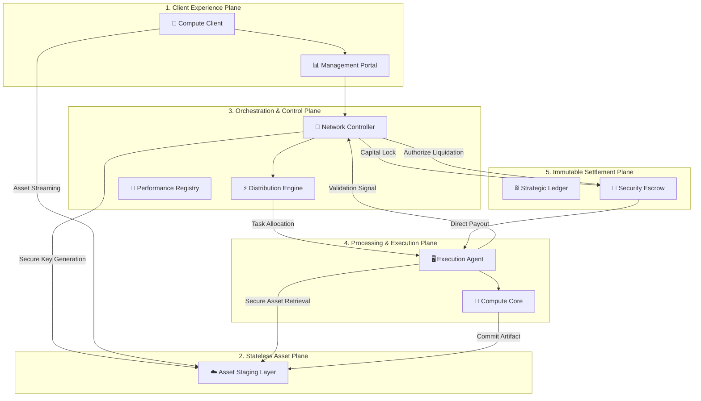

# Architecture Overview

**Mental Model:** RenderOnNodes is a distributed operating system for GPU compute. The **Backend** acts as the brain (orchestration), the **Solana Blockchain** acts as the legal and financial system (settlement), and a global network of **Nodes** acts as the muscle (execution).

---

## High-Level System Architecture

The Platform is organized into four proprietary logic planes: **Client Experience**, **Network Orchestration**, **Distributed Execution**, and **Immutable Settlement**.

---

## Strategic Domain Breakdown

### 1. The Orchestration Plane (Network Controller)
The Orchestration Plane functions as the network’s central intelligence. It maintains the global state and manages the lifecycle of all compute tasks without ever interacting with raw project data.
- **Task Orchestrator:** Manages job atomicity, ensures fragment redundancy, and coordinates multi-step execution flows.
- **Optimized Distribution Engine:** A high-frequency matching system that evaluates real-time agent availability and hardware profiles to ensure sub-second task allocation.
- **Telemetry & Health Monitoring:** Oversees the persistence and stability of thousands of concurrent network connections, performing automated failover to ensure zero-downtime reliability.

### 2. The Processing Plane (Execution Layer)
The execution layer is comprised of a globally distributed network of independent agents.
- **Hardware Abstraction Layer:** Provides a standardized interface for various compute architectures, ensuring consistent execution across diverse hardware environments.
- **Resource Sentinel:** Actively monitors thermal and system-load vitals to protect host infrastructure while maintaining peak performance for assigned tasks.
- **Isolated Execution Environment:** Guarantees that every task is performed in a secured, restricted sandbox to preserve both the agent’s stability and the client's privacy.

### 3. The Stateless Asset Plane (Data Staging)
A high-throughput, ephemeral staging layer is utilized for the secure exchange of large-scale assets.
- **Secure Staging Logic:** Assets move directly between clients and execution agents using time-limited, cryptographically verified authorization. No project data resides on central platform infrastructure.
- **Immutable Privacy Policy:** All compute-related data is subject to a strict lifecycle purge, ensuring that the platform remains a stateless throughput engine.

### 4. The Immutable Settlement Plane (Financial Layer)
The financial layer provides the trustless foundation for all value exchange on the network.
- **Programmatic Escrow:** Eliminates counterparty risk by locking funds before execution and releasing them only upon verified delivery.
- **Capital Efficiency:** The platform manages network interaction costs internally, ensuring a seamless experience for both clients and agents while maintaining full ledger transparency.

---

## Communication Protocols

RenderOnNodes uses a hybrid communication model:
- **REST / GraphQL:** Used for standard dashboard interactions and job submissions.
- **WebSockets / gRPC:** Used for low-latency communication between the Backend and Provider Nodes to ensure "instant-start" rendering.

:::info[Next Step]
To see exactly how these components interact in a single render job session, proceed to the **[Job Lifecycle](./job-lifecycle)** document.
:::
