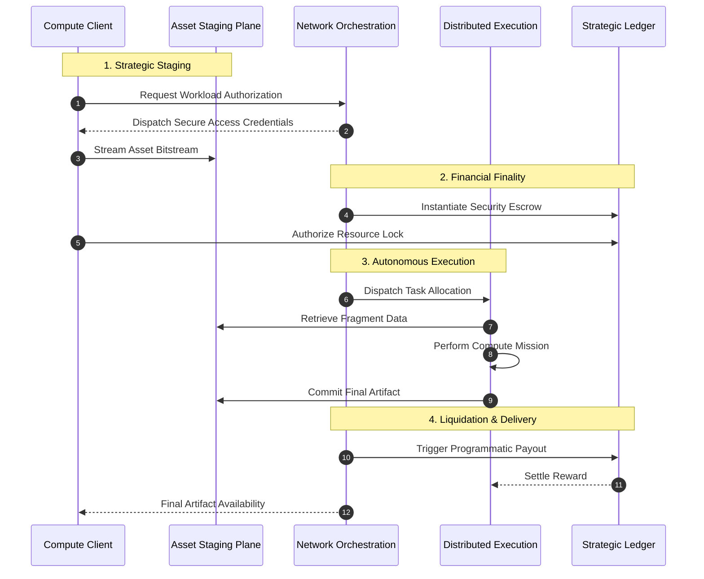

# The Job Lifecycle: End-to-End

**Mental Model:** Think of a job on RenderOnNodes not just as a file transfer, but as a **distributed, cryptographic transaction** orchestrated by the Backend and settled by a Solana Smart Contract. No party needs to trust the other; the system enforces the rules of engagement automatically.

---

## Strategic Lifecycle Overview

The following sequence illustrates the orchestration of a compute mission across the network’s logic planes.

---

## Phase 1: Symmetric Asset Staging
Large-scale compute mandates a high-velocity data strategy. RenderOnNodes utilizes a **Stateless Staging Plane** where project assets are streamed directly from the client to a globally distributed buffer.
1. **Introspection:** The management portal identifies the necessary resource fragments.
2. **Access Credentials:** The controller issues secure, time-limited cryptographic keys for asset transmission.
3. **Optimized Streaming:** Data is transferred in parallel fragments to a secure staging environment, bypassing central platform bottlenecks to ensure maximum throughput.

## Phase 2: Programmatic Escrow
To maintain network integrity, every compute mission is backed by a secure financial lock.
- The platform calculates the projected resource requirements.
- The Client authorizes a **Capital Lock** within the strategic Ledger.
- Only once the network confirms resource availability and financial lock finality does the mission enter the prioritized distribution queue.

## Phase 3: Autonomous Mission Dispatch
As governed by the **[Distribution Engine](./scheduler-and-queues)**, the network selects an optimal execution agent.
- The selected agent receives secure, encrypted access to the staging buffer.
- Compute is performed in a protected sandbox, ensuring host stability and mission privacy.
- Upon completion, the agent commits the final artifact fingerprint to the network registry.

## Phase 4: Automated Verification & Delivery
Once the orchestration plane validates the compute integrity:
- **Settlement:** The strategic ledger executes the programmed reward distribution.
- **Liquidation:** The system handles all network-level interaction costs, as detailed in the **[Settlement System](./settlement-system)**.
- **Artifact Access:** The Client is notified of mission finality, and the resulting artifacts are immediately available for retrieval via the Management Portal.

For details on how payouts are batched, see the **[Settlement System](./settlement-system)** guide.

---

## Automatic Failover (The Retry Policy)
Nodes are independently operated hardware and can occasionally go offline due to power loss or thermal instability.
1. **Heartbeat Timeout:** If a Node stops communicating for more than 5 minutes, the system assumes failure.
2. **Infinite Retry:** The backend marks the Node as `OFFLINE` (penalizing its Reputation) and instantly requeues the job for the next available, high-trust Node.
3. **No Duplicate Charges:** The Artist is never charged for a failed node attempt. One price guarantees one successful render.

:::info[Deep Dive]
Curious how the hardware is managed? Read the **[Node Lifecycle & Reputation](./node-lifecycle)** doc to learn how trust scores prevent bad actors from entering the network.
:::
