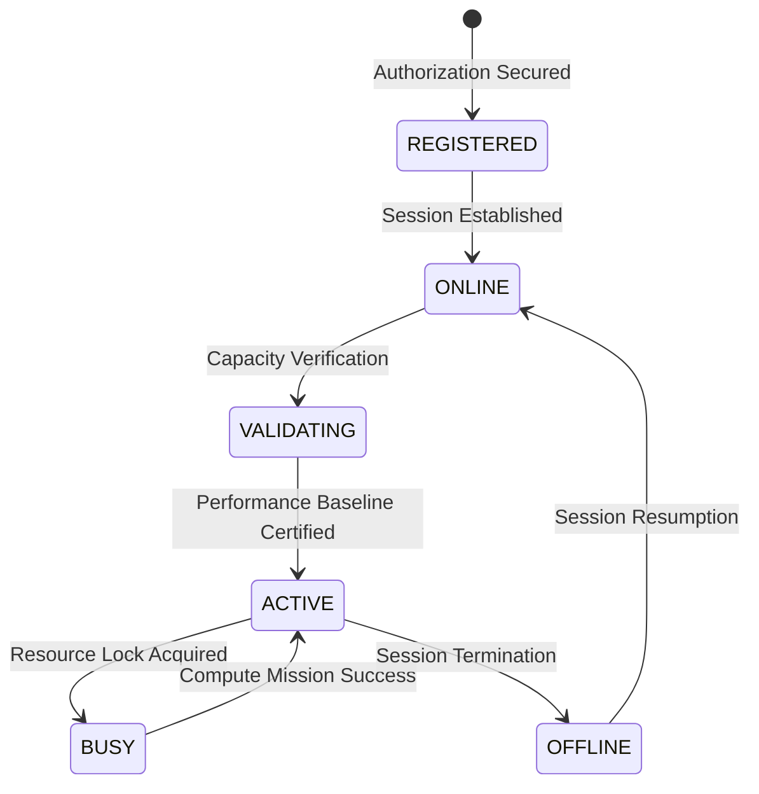

# Node Lifecycle & Reputation

**Mental Model:** An Execution Agent is a high-availability network resource. Reliability is its primary value proposition. The platform treats every Agent as a dynamic entity that must consistently validate its compute capacity and network stability to maintain access to premium task tiers.

---

## Agent Operational States

An agent transitions through several strategic states to ensure network integrity and task finality.

### 1. REGISTERED
The initial entry point where a hardware profile is bonded to a secure settlement address. In this state, the agent is recognized by the network directory but has no compute privileges.

### 2. ONLINE (Idle)
The agent has established a persistent, high-frequency connection to the Orchestration Plane. It broadcasts its operational telemetry (resource load, thermal metadata) but is not yet qualified for production workloads.

### 3. VALIDATING (Certification)
Before promotion to the active resource pool, the agent must pass a **Performance Certification** task. This process verifies that the reported capacity matches actual throughput, preventing resource misrepresentation.

### 4. ACTIVE
The agent is certified and entered into the global matchmaking discovery pool. It is fully qualified to accept and execute production fragments.

### 5. BUSY
The agent has acquired a dedicated resource lock. During this phase, it is removed from the discovery pool to ensure 100% resource dedication to the current compute mission.

---

## The Network Trust Engine

RenderOnNodes utilizes a multi-dimensional **Trust Score (0-100)** to grade agent quality and reliability.

### Performance Indicators
- **Task Finality:** Consistent delivery of valid datasets within predicted time envelopes.
- **Session Consistency:** Extended operational windows without unplanned disconnections.
- **Throughput Stability:** Reliable hardware performance profiles without degradation markers.

### Risk Indicators
- **Execution Failures:** Environment-level exceptions or process-level interruptions.
- **Mission Abandonment:** Unexpected termination of the agent process while resource locks are active.
- **Data Mismatches:** Returning results that fail the network's proprietary verification checks.

---

## Economic Impact of Reputation

The **Job Scheduler** uses Trust Scores as a primary weighting factor:

| Trust Score | Job Tier Eligibility | Priority |
|---|---|---|
| **90 - 100** | Premium (High RON/Frame) | Tier 1 (First access) |
| **70 - 89** | Standard | Tier 2 |
| **50 - 69** | Economy | Tier 3 |
| **Below 50** | Benchmarking Only | Suspended from paid queue |

:::tip[Optimization Tip]
Providers are encouraged to maintain a stable environment with adequate cooling to prevent thermal throttling, which can inadvertently lower render performance and hurt your Trust Score.
:::
