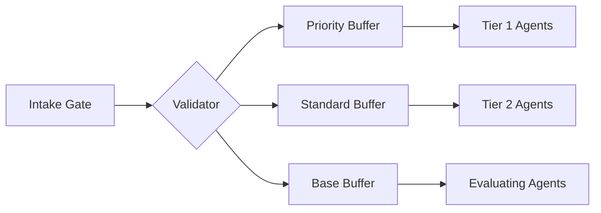

# Scheduler & Queues

**Mental Model:** The Distribution Engine is the platform's high-frequency "Task Clearing House." It functions as a strategic balancer, continually matching resource "Supply" (Agent availability) against compute "Demand" (Job requirements) based on liquidity, latency, and hardware constraints.

---

## Optimized Distribution Logic

The RenderOnNodes Distribution Engine is a specialized, low-latency system designed to maximize global throughput. When a mission is submitted, the engine evaluates four primary strategic variables to determine optimal agent allocation.

### 1. Hardware Determinants (Baseline Constraints)
The engine first filters the global agent directory for resources that meet the mission's immutable operational requirements:
- **Compute Architecture:** Verifying the agent's compatibility with the required execution engine.
- **Resource Saturation:** Ensuring the mission's memory footprint fits within the agent's dedicated capacity.
- **Instruction Compatibility:** Confirming the environment and binary versioning match the project specification.

### 2. Reputation & Trust Grading (Dynamic Weighting)
As detailed in the **[Node Lifecycle](./node-lifecycle)**, the Trust Score acts as a prioritization multiplier. Agents with a Tier-1 reputation are prioritized for high-value, time-sensitive mission fragments.

### 3. Geographic Optimization (Latency Minimization)
To minimize transit overhead, the engine prefers agents with the lowest latency profiles to the specific staging buffer where the project assets are located.

### 4. Strategic Priority
Clients can specify the desired urgency of their compute request:
- **Priority Tier:** Optimized for speed; routed exclusively to the highest-performing, most reliable agents.
- **Standard Tier:** Balanced for cost and efficiency; executed across the broader active agent pool.

---

## Segmented Prioritization Strategy

RenderOnNodes utilizes a **Segmented Prioritization Queue (SPQ)** to manage thousands of concurrent compute fragments.

### Fragment Parallelization
For large-scale missions, the engine utilizes **Atomic Parallelization**:
- Complex projects are automatically fragmented into discrete compute missions.
- These fragments are dispatched to multiple agents simultaneously across the global network.
- This results in a non-linear reduction in execution time, allowing multi-hour tasks to be completed in minutes.

---

## Failover & Retries

If a node accepts a job but fails to return a frame within the **Expected Time To Render (ETTR)**:
1. The scheduler marks the node as `FAILED`.
2. The node's Reputation Score is penalized.
3. The specific frame is instantly put back into the high-priority "Retry Queue" and reassigned to a different, higher-trust node.
4. The Artist is never charged for the failed attempt.

:::info[Technical Note]
The scheduler is built on a high-availability cluster using gRPC for near-zero latency communication with nodes, ensuring the "assignment-to-execution" time is measured in milliseconds.
:::
