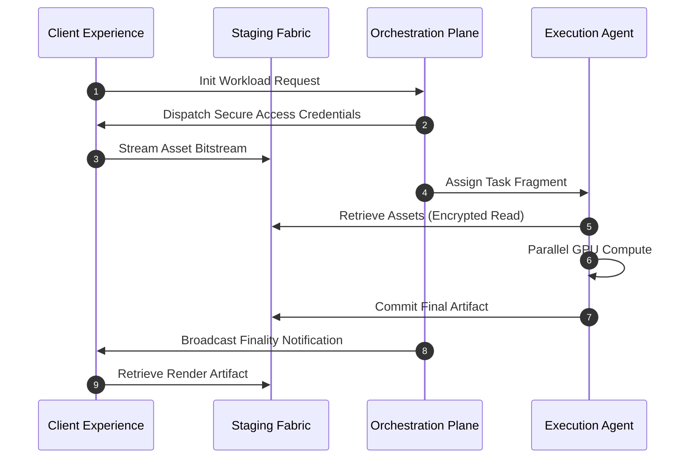

# Asset Management & Security

**Mental Model:** The Asset Plane is a stateless, ephemeral "Exchange Buffer." It is designed for high-velocity bitstream staging, ensuring that proprietary source data is only accessible during the active compute window and is purged immediately following mission finality.

---

## Infrastructure Flow

RenderOnNodes utilizes a globally distributed, high-performance **Staging Fabric** as the central buffer for mission data. This ensures that massive file assets are transferred with maximum available bandwidth, bypassing central platform bottlenecks.

---

## Secure Asset Isolation

Data security is a primary concern when distributing proprietary mission files across a distributed network.

### 1. Cryptographic Access Credentials
At no point do Clients or Agents have permanent access keys to the network’s staging infrastructure. 
- The Orchestration Plane generates **Temporary Access Tokens** with strict expiration windows.
- These credentials allow the client’s browser or the agent’s compute core to stream data directly, ensuring maximum efficiency without exposing persistent permissions.

### 2. Isolated Execution Environment
When an execution agent retrieves a mission fragment, it is processed within a temporary, high-security sandbox.
- The agent’s local file system is isolated from the mission data.
- Upon mission finality and artifact verification, the compute core performs a **Secure Wipe** of all local temporary data to prevent project persistence.

---

## Strategic Retention Policy

RenderOnNodes is a high-throughput compute engine, not a permanent data repository. To maintain operational leaness and ensure privacy, the network enforces an **Immutable Lifecycle Purge**:

| Artifact Class | Retention Period | Action |
|---|---|---|
| **Mission Source Data** | 24 Hours | Automated Secure Wipe after fragment finality |
| **Output Artifacts** | 7 Days | Purged from Staging (Must be retrieved by Client) |
| **Mission Metadata** | Permanent | Maintained for audit and ledger transparency |

:::warning[Important]
Clients must retrieve their completed artifacts within 7 days. After this window, the staging fabric is permanently purged to ensure that no proprietary data remains on platform infrastructure.
:::

---

## Resilience Optimization: Parallel Staging

For large-scale mission assets, the system supports **Parallel Streaming**. Instead of relying on a single, fragile data pipe, assets are streamed in discrete fragments. This ensures high reliability and fast resumption even in the event of local network fluctuations.

:::info[Next Step]
To understand how these missions are matched to financial finality, proceed to the **[Settlement System](./settlement-system)**.
:::
