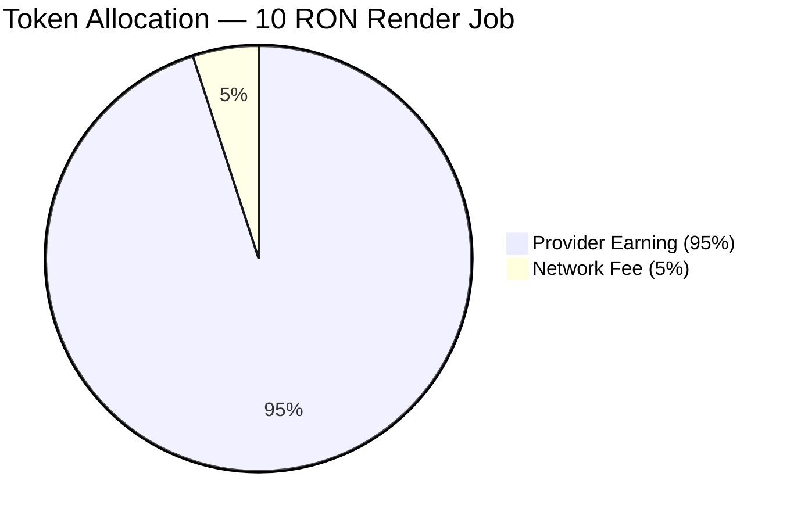

# The Token Economy: RON & SOL

**Mental Model:** On RenderOnNodes, computation is purchased and sold using two distinct tokens. **RON** is the platform's native compute credit — the economic unit of rendering work. **SOL** is Solana's native token, used exclusively to pay the blockchain's transaction fees. You must hold both to interact with the platform.

---

## RON — The Compute Credit

**RON** (the RenderOnNodes platform token) is the unit of value used to price, purchase, and award computational work on the network.

- **Compute Clients** spend RON to submit rendering jobs.
- **Node Providers** earn RON for every successfully completed and validated render.

RON is not a speculative asset on external markets — it is a utility token with a single purpose: programming GPU compute time on the RenderOnNodes network.

### SOL — The Infrastructure Fuel
Every interaction with the strategic ledger — locking resources in escrow, triggering a settlement delivery, or verifying compute finality — requires a marginal infrastructure fee paid in SOL.

**Platform-Managed Fees:** To provide a seamless experience, RenderOnNodes manages the friction of these network fees for all core compute operations. Submissions, automated matching, and settlement deliveries are fully managed by the platform.

**User-Initiated Transitions:** Clients and Agents are only responsible for transaction fees when manually moving funds into or out of the network’s strategic vault (Deposits and Withdrawals). We recommend maintaining a marginal SOL reserve (e.g., 0.05 SOL) to ensure these manual transactions are always prioritized by the ledger.

### How the Escrow Contract Protects Both Parties

When a Client submits a job, the estimated cost in RON is immediately locked in the **RenderOnNodes Escrow Smart Contract** on Solana. This lock is enforced at the protocol level. Neither the Client nor the platform can access those funds while the job is active. The contract releases payment to the Provider only upon confirmed delivery of the rendered frames.

This mechanism eliminates a core failure mode of traditional render farms: Artists being charged for jobs that fail, or Providers completing work they are never compensated for.

---

## SOL — The Network Gas

RenderOnNodes operates entirely on the **Solana Blockchain**.
Solana requires a transaction fee (gas) to write any state changes to the ledger. However, to ensure a seamless experience for both Artists and Providers, **RenderOnNodes pays the majority of these fees.**

### Who Pays for Gas?

- **The Platform Pays For:** 
  - **Job Creation:** Opening the smart contract account when a new project is submitted.
  - **Batch Releases:** Aggregating and processing the complex logic that releases payouts to Providers.
- **The Users (Artist/Provider) Pay For:**
  - **Depositing Funds:** Moving RON from your wallet into the platform's escrow balance.
  - **Withdrawing Funds:** Moving your earnings or remaining balance back to your private wallet.

> **Decision Point:** Because the platform subsidizes the most frequent background transactions, you only need a very small amount of SOL. We recommend keeping roughly `0.02 SOL` in your wallet to cover manual deposit and withdrawal signatures. Without at least some SOL, the blockchain will reject these manual interactions.

---

## The Flow of Funds

The following table illustrates the allocation of token flows for a standard `10 RON` rendering job:

| Party | Action | Amount |
|---|---|---|
| **Client** | Locks in escrow on job submission | `10 RON` |
| **Provider** | Receives upon successful delivery | `9.5 RON` |
| **Network** | Retained for infrastructure & token mechanics | `0.5 RON` |

The network fee is not consumed arbitrarily. It funds the operational infrastructure of the matching engine, scheduler, and storage layer, and feeds the platform's long-term token equilibrium mechanism.

---

## Funding Your Wallet

Since RON is the RenderOnNodes platform's own token, it is not available on external exchanges. To fund your account:

1. **Acquire SOL** from any major exchange (Coinbase, Binance, Kraken, or Bybit) using a bank transfer or card.
2. **Withdraw SOL** to your Phantom or Solflare wallet address. When selecting the network on the exchange, always choose **Solana** — never Ethereum or BSC.
3. **Convert or deposit RON** through the platform's internal onboarding flow once your SOL arrives.

:::caution[Network Selection]
When withdrawing from any exchange to your Solana wallet, confirm the withdrawal network is set to **Solana (SOL)**. Sending assets over the wrong network results in permanent, unrecoverable loss of funds. This error cannot be reversed by RenderOnNodes or the exchange.
:::

---

:::info[Next Step]
Your wallet is funded and your account is ready. Proceed to **[Core Concepts](../concepts/architecture-overview)** to understand how the system orchestrates jobs from submission to settlement, or go directly to the **[Client Quickstart](../clients/artist-quickstart)** to submit your first render.
:::
